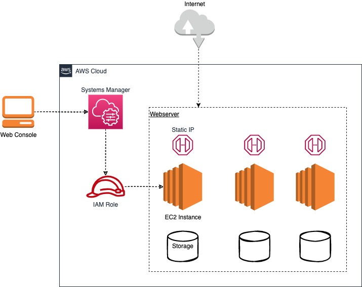

# aws-webserver-module

## Simple sketch module by Terraform

#### Prerequisites
- AWS Account
- Exported credentials locally

#### Resources
- Security group 
- IAM Role with profile

#### Meta-args
- Throught *count* you can manage the number of webservers as needed 

#### Deployment Diagram

